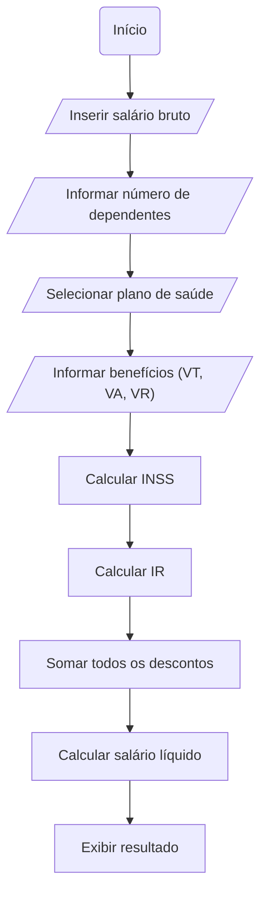

## 💻 Calculadora de Salário Líquido
Este projeto em Java é uma calculadora de salário líquido que solicita informações do usuário e calcula os descontos de INSS, Imposto de Renda, benefícios como plano de saúde, vale transporte, alimentação e refeição, levando em conta também o número de dependentes.

 ## 🛠️ Funcionalidades
Entrada interativa de dados do usuário via console;

Cálculo automático do desconto de INSS conforme faixas;

Cálculo do IR com base em número de dependentes;

Cálculo de benefícios opcionais (plano de saúde, VT, VR, VA);

Exibição detalhada dos descontos e do salário líquido final.

Abaixo está o fluxograma detalhado do funcionamento:

## 📊 Diagrama de Fluxo


## 🚀 Como Executar
1. Certifique-se de ter o Java instalado (versão 8 ou superior).
2. Compile o programa:
   ```bash
   javac CalculadoraSalario.java


